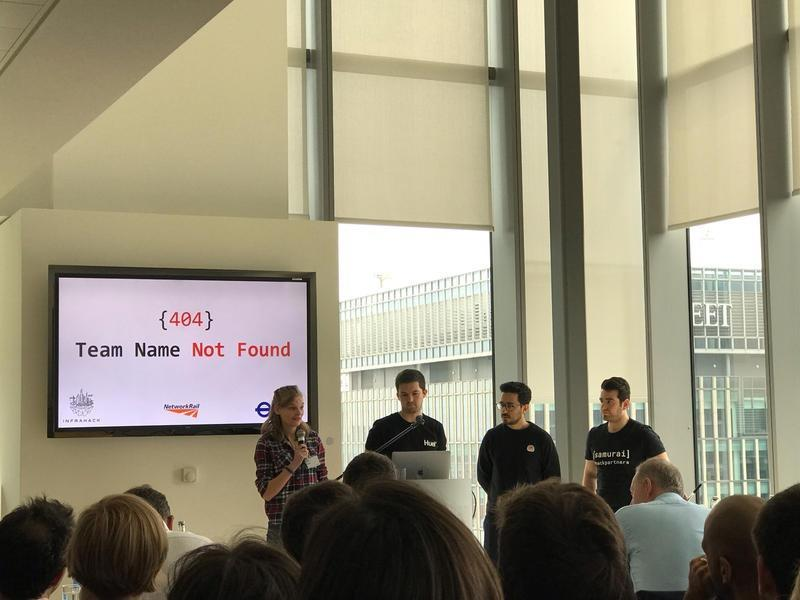
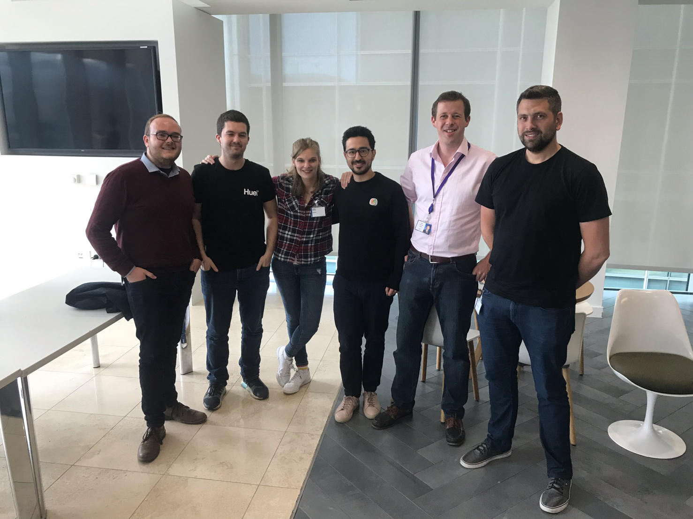
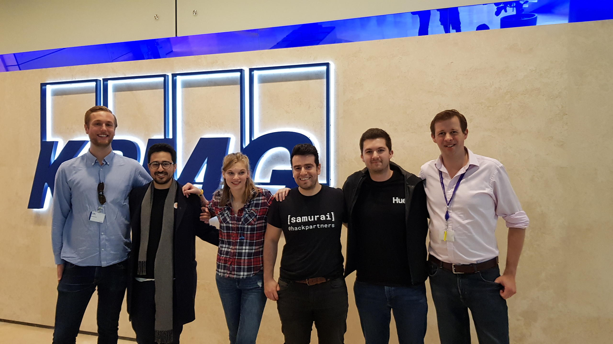
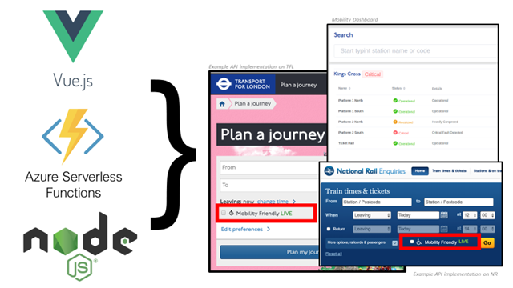

# Infrahack: Infrastructure Hackathon - Live Lift / Escalator Operational Status

**Live Demo**: https://tfl-lift-dash.as93.net/

I had the opportunity to participate in [Hack Partners'](https://www.linkedin.com/company/10041577/?lipi=urn%3Ali%3Apage%3Ad_flagship3_detail_base%3BPSq2bFUkTu2FD%2BgGO6lZvA%3D%3D) infrastructure hackathon - [Infrahack](http://infrahack.hackpartners.com/)!

I cannot believe we that we 🏆 **Won the 1st prize at Infra-hack 2019 plus Network Rail, and TFL's awards.** 🏆

The Infrahack finals was held at [KPMG Headquarters](https://home.kpmg/uk/en/home.html) in London's Canary Wharf, during which our solution was unanimously judged as the winning solution by the decision makers of the UK's infrastructure industry which include: 
- **Bridget Rosewell** (Commissioner of the UK National Infrastructure Commission)
- **Philip Graham** (Chief Executive of the UK National Infrastructure Commission)
- **Glen Worrall** (Principal Application Engineer at Bentley Systems)
- **Russell Goodenough** (Vice President at CGI)
- **Annette Pass** (Head of Innovation at Highways England)
- **Darren Russell** (Chief Digital Officer at Mott MacDonald)
- **Nigel Watson** (CIO at North thumbrian Water Group)

**We didn't just tackle one challenge but two challenges in only 48 hours!**

---

### Problem 1 - Passengers with reduced mobility have no access to live lift or escalator information across the UK's train stations.

Over a weekend we built a public accessibility API, to provide live information on lift and escalator operational status across every station in the UK to the public! This API can be used by journey planner apps such as [National Rail Enquiries](https://www.nationalrail.co.uk/) and [trainline](https://www.thetrainline.com/) to provide mobility friendly journey itineraries to passengers.  

See below for the technology stack we used to build the API and example implementation.
### Accessability API Technology Stack

Within the 48 hours, we also developed a customer/maintainer dashboard that uses the API.

### Demo of the Front-end dashboard

---

# Problem 2 - Priorotisation of Lifts / Escalators Maintenance

In addition to that, we also leveraged **machine learning and computer vision algorithms** on Network Rail's CCTV footage to recommend appropriate lift maintenance cycles so that maintainers can priorotise the maintenance of heavily used lifts or escalators across the UK. The CV algorithm is used to count number of people using the station or its assets which can inform operations and maintenance strategy of the stations.

### Demo of the CCTV CV Algorithm

Obviously, I could not do this without my team pulling all-nighters over the weekend - [Alicia Sykes](https://www.linkedin.com/in/ACoAABB2blMBZApcjKpW18MBmrFrn3Eab7e9SCM/?lipi=urn%3Ali%3Apage%3Ad_flagship3_detail_base%3BPSq2bFUkTu2FD%2BgGO6lZvA%3D%3D), [Jamie Haywood](https://www.linkedin.com/in/jamiehaywood/?lipi=urn%3Ali%3Apage%3Ad_flagship3_detail_base%3BPSq2bFUkTu2FD%2BgGO6lZvA%3D%3D&licu=urn%3Ali%3Acontrol%3Ad_flagship3_detail_base-hover_card_entity_name), and [Kayvane Shakerifar](https://www.linkedin.com/in/ACoAAAzE8tgBS09RikYvFqX9WGb5g64OQWxyAlU/?lipi=urn%3Ali%3Apage%3Ad_flagship3_detail_base%3BPSq2bFUkTu2FD%2BgGO6lZvA%3D%3D).

My contribution was in **data wrangling, cleaning and co-development of the API** with Jamie using:
- Python
- Jupyter notebooks
- Node.js
- Azure serverless functions. 

Kayvane worked on the CCTV computer vision algorithm using:
- [YOLO3](https://pjreddie.com/darknet/yolo/) open source object detection CV library

And Alicia developed the front-end dashboard with:
- Vue.js.

I would like to thank everyone - mentors, judges and in particular, the organisers - who provided us with the opportunity to work on such interesting problems in this hackathon. I would also like to thank [Bletchley park's National museum of computing](https://bletchleypark.org.uk/visit-us/the-national-museum-of-computing) for hosting us over the weekend.

I'm excited to see how we can take our accessibility API, and machine learning platform forward with  Transport for London and Network Rail.

##### Copyright (c) Ali Parandeh
